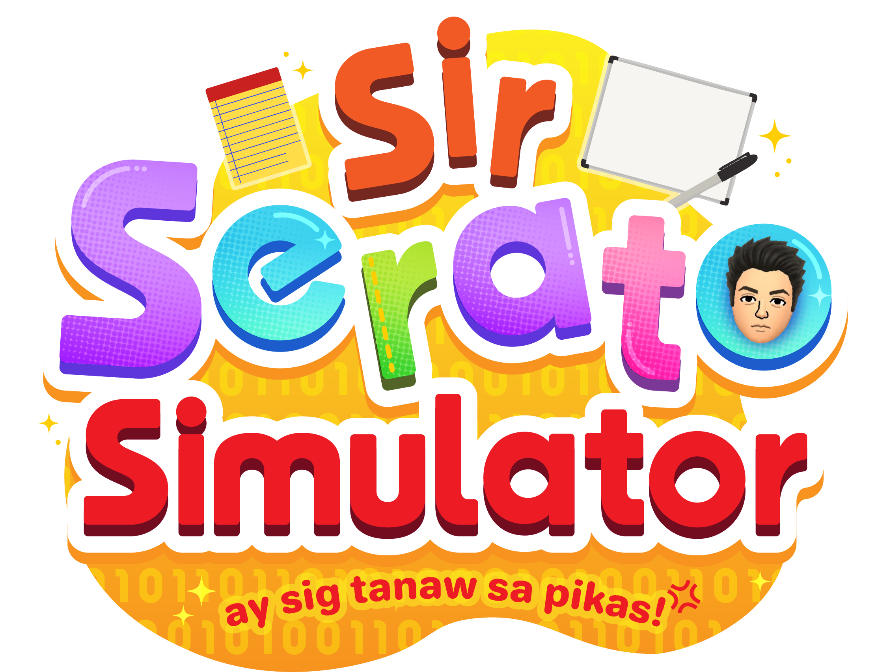

# Sir Serato Simulator: "Ay Sig Tanaws Pikas!"

---
## 📎Group Members
* Chloe Julia Geonzon
* Iren Nathaleigh Guinita
* Sophia Gabrielle Logarta
* Aissha Monceda
* Mary Rose Pacina

---
## 📎 Project Description / About the Game

<b>Sir Serator Simulator</b> is a high-stake arcade classroom management simulator game where you act as the iconic teacher, <b><i>Sir Jay Vince Serato</i></b>, proctoring a set of
students that are taking your quizzes. Of course, being a teacher comes with its own set of problems.
You must be vigilant in ensuring that your students do not attempt to cheat or else you will lose
your patience and your sanity.

---
## 📎Core Mechanics

### ⋆˚࿔ The Player's Life
* Every teacher has their own limits when handling students. The player's lives will be represented with **three lives**.
* **Failing to catch a student cheating** or **falsely accusing a student of cheating** may drain your sanity meter.
* When your number of lives hit zero, it's **game over**

### ⋆˚࿔ Cheating Behaviors
Students will exhibit specific visual cues. You must quickly intercept whatever your students are up to. 
When a student is **turning their heads** to look left or right, that's when you should click and warn them!

### ⋆˚࿔ Possible Red Herrings
While these visual cues might look like the student is cheating, they are not. This might cause you to
falsely accuse a student of cheating, so make sure to double-check!

### ⋆˚࿔ The "Tre"
**Tre** falls under another type of student in the game. I assure you he does **not actually attempt to cheat**
because he is not afraid to **ask questions** when he's confused. Your job as a teacher is to accommodate Tre by **clicking him
multiple times** til he feels as if his question is answered. During his questioning state, you **cannot** check the other side of the room.

--- 
## 📎 Scoring System
### ⋆˚࿔ Base Score Values
The game is set at endless mode, challenging players to set high scores to be shown in the leaderboard.
Below are the different actions triggered to gain or lose points.

| Action                         | Base Points                     |
|:-------------------------------|:--------------------------------| 
| Catch student cheating         | <samp>+120</samp>               |
| False Accusation               | <samp>-1 LIFE</samp>            |
| Student got away with cheating | <samp>-150 + Streak lost</samp> |

### ⋆˚࿔ Score Multiplier
As you catch students cheating without making any mistakes, your **score multiplier** increases.
* **1x Multiplier**: Base points
* **2x Multiplier**: Activated when catching 3 students in a row
* **3x Multiplier**: Activated when catching 5 students in a row
* **4x Multiplier**: Activated when catching 7 students in a row
* **5x Multiplier**: Activated when catching 10 students in a row
* **100x Multiplier**: Activated when catching 67 students in a row
---
## 📎Controls
* <kbd>Left Click</kbd> - Catch a cheater or interact with requests.
* <kbd>A</kbd> - View the left side of the classroom.
* <kbd>D</kbd> - View the right side of the classroom.
* <kbd>E</kbd> - "Shush" the class to turn them back to their idle state. You can only shush students when you have a streak of 6 students.
* <kbd>Esc</kbd> - Pause the game.
---
## 📎Project Details
The following dive more into the initial planning and development of the game:

### ⋆˚࿔ Planned Technologies
* **Language**: Java
* **GUI Framework**: JavaFX and FXGL
* **Database Connectivity**: JDBC (Java Database Connectivity)
* **Database**: MySQL

### ⋆˚࿔ Proposed Features
* **Endless Proctored Simulation**: A continuous game loop where students transition through different student states.
* **Local High Score Leaderboard**: A persistent scoreboard that saves the top 10 scores and player names using JDBC to communicate with a MySQL database
* **Asynchronous Multi-Threaded Score Management**: Implements native Java multi-threading via an UpdateScoreRunnable worker thread to handle scoring calculations in the background, preventing gameplay stutters on the FXGL main application thread.
* **Dual-View Camera Navigation (Scene Swapping)**: Leverages a clever visibility-toggling system to switch seamlessly between the left and right sides of the classroom, tracking the position and visibility of 18 separate student and distractor (tre) entities in real-time.
* **Dynamic Session Tracker & Live Mission System**: Tracks real-time session stats (such as duration, total attempts, and false accusations) via an isolated background loop while supporting a generic task repository that manages ongoing progression targets.

### ⋆˚࿔ Evaluation Criteria Mapping (Initial)
* **Object-Oriented Programming (OOP)**:
  * **Abstraction**: StudentState is an abstract base class used to inherit core attributes like timers, audio playbacks, and component mapping without code duplication.
  * **Inheritance**:
    * Specific behaviors such as idling, suspicion, cheating, and distracting extend a centralized StudentState.
    * Custom game screens seamlessly integrate with the engine's interface layout by extending core structural classes like SubScene and FXGLMenu.
  * **Encapsulation**: Critical visual assets, state variables, and animation channels are kept strictly private within their respective classes, forcing all interactions through public wrappers like changeState() and playCheatingAnimation() to protect data integrity across threads.
  * **Polymorphism**: The StudentComponent manages a single, uniform StudentState field, allowing the system to dynamically execute completely different logic or trigger state-specific animations during runtime without needing to know the student's exact active behavior class. 
* **Graphical User Interface (GUI)**
  * **JavaFX & FXGL**: An interactive classroom interface built using FXGL’s layering system, with FXML used specifically for static scenes.
* **Design Patterns**
  * **State Design Pattern**: Student behaviors are encapsulated into independent, concrete state classes that extend a common StudentState base, allowing the StudentComponent to dynamically swap a student's entire logic and animation routine at runtime via a centralized changeState() method.
  * **Singleton Design Pattern**: AudioManager utility restricts its instantiation to a single, globally accessible instance throughout the lifecycle of the application to eliminate disk access latency and prevent overlapping sound glitches during intense gameplay.
  * **Factory Design Pattern**: Centralized inside MyEntityFactory, which implements FXGL’s EntityFactory interface, this pattern uses @Spawns annotations to decouple the creation and structural configuration of game objects from the orchestrating game loop.
* **Model-View-Controller (MVC)**
  * **Model**: Handles the student logic and score data
  * **View**: FXGL, Entities
  * **Controller**: Input handlers for mouse clicks and keys
* **Unified Modelling Language (UML**)
  * Use-Case Diagram
    
  * _(to-do: add more digram)_