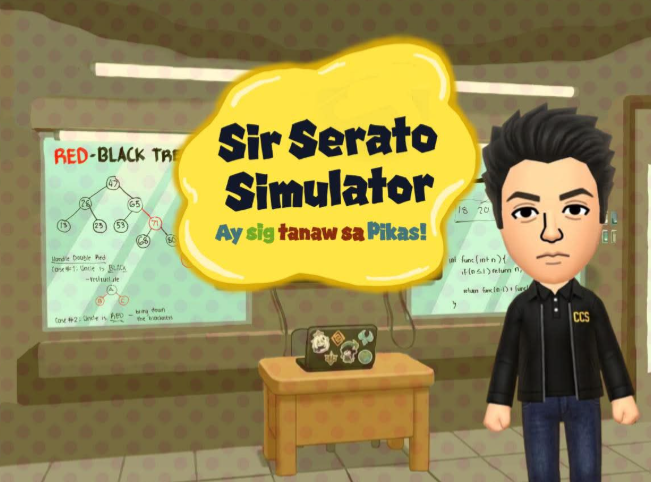

# Sir Serato Simulator: "Ay Sig Tanaws Pikas!"

(_to-do: change current pic to final logo of game_)

---
## 📎Group Members
* Chloe Julia Geonzon
* Iren Nathaleigh Guinita
* Sophia Gabrielle Logarta
* Aissha Monceda
* Mary Rose Pacina

---
## 📎 Project Description / About the Game

<b>Sir Serator Simulator</b> is a high-stake arcade classroom management simulator game where you act as the iconic teacher, <b><i>Sir Jay Vince Serato</i></b>, proctoring a set of
students that are taking your exams. Of course, being a proctor comes with its own set of problems.
You must be vigilant in ensuring that your students do not attempt to cheat or else you will lose
your patience and your sanity.

---
## 📎Core Mechanics

### ⋆˚࿔ The Player's Life
* Every teacher has their own limits when handling students. The player's lives will be represented with a **Sanity Meter**.
* **Failing to catch a student cheating** or **falsely accusing a student of cheating** may drain your sanity meter.
* When your patience hits zero, it's **game over**

### ⋆˚࿔ Cheating Behaviors
Students will exhibit specific visual cues. You must quickly intercept whatever your students are up to.
* Looking side-to-side
* Using their phone
* Reaching for another student's paper
* Folded notes passed around

### ⋆˚࿔ Possible Red Herrings
While these visual cues might look like the student is cheating, they are not. This might cause you to
falsely accuse a student of cheating, so make sure to double-check!

--- 
## 📎 Scoring System
### ⋆˚࿔ Base Score Values
The game is set at endless mode, challenging players to set high scores to be shown in the leaderboard.
Below are the different actions triggered to gain or lose points.

| Action                 | Base Points       |
|:-----------------------|:------------------| 
| Catch student cheating | <samp>+120</samp> | 
| Sharp Eye Bonus | <samp>+267</samp> |
| False Accusation | <samp>-250</samp> |
| Student got away with cheating | <samp>-120</samp> |

### ⋆˚࿔ Score Multiplier
As you catch students cheating without making any mistakes, your **score multiplier** increases.
* **1x Multiplier**: Base points
* **2x Multiplier**: Activated when catching 3 students in a row
* **3x Multiplier**: Activated when catching 5 students in a row
* **4x Multiplier**: Activated when catching 7 students in a row
* **5x Multiplier**: Activated when catching 10 students in a row
* **100x Multiplier**: Activated when catching 67 students in a row
---
## 📎Controls
* <kbd>Left Click</kbd> - Catch a cheater or interact with requests.
* <kbd>E</kbd> - "Shush" the class to reduce noise. You can only shush students when you have a streak of 6 students.
* <kbd>Esc</kbd> - Pause the simulation.
---
## 📎Project Details
The following dive more into the initial planning and development of the game:
### ⋆˚࿔ Planned Technologies
* **Language**: Java
* **GUI Framework**: JavaFX and FXGL
* **Database Connectivity**: JDBC (Java Database Connectivity)
* **Database**: MySQL

### ⋆˚࿔ Proposed Features
* **Endless Proctored Simulation**: A continuous game loop where students transition through different student states.
* **Local High Score Leaderboard**: A persistent scoreboard that saves the top 10 scores, player names, and dates using JDBC to communicate with a MySQL database
* _(to-do: add more of dis)_

### ⋆˚࿔ Evaluation Criteria Mapping (Initial)
* **Object-Oriented Programming (OOP)**:
  * **Inheritance & Polymorphism**: Implementation of a base GameEntity or Person class, with specific subclasses for Student, Teacher (Sir Serator), and Distraction (Environmental hazards).
  * **Encapsulation**: All game states are kept private within components, accessible only through controlled public methods to ensure data integrity during the game loop.
* **Graphical User Interface (GUI)**
  * **JavaFX & FXGL**: An interactive classroom interface built using FXGL’s layering system, with FXML used specifically for static scenes.
* **Unified Modeling Language (UML)**
  * _(to-do: finalize this)_
* **Design Patterns**
  * **Singleton Patterns**: Used for classes that handles the score and assets, ensuring points and textures are managed by a single, globally instance.
  * _(to-do: try to find more design patterns for implementation)_
* **Model-View-Controller (MVC)**
  * **Model**: Handles the student logic and score data
  * **View**: FXGL, Entities
  * **Controller**: Input handlers for mouse clicks and keys